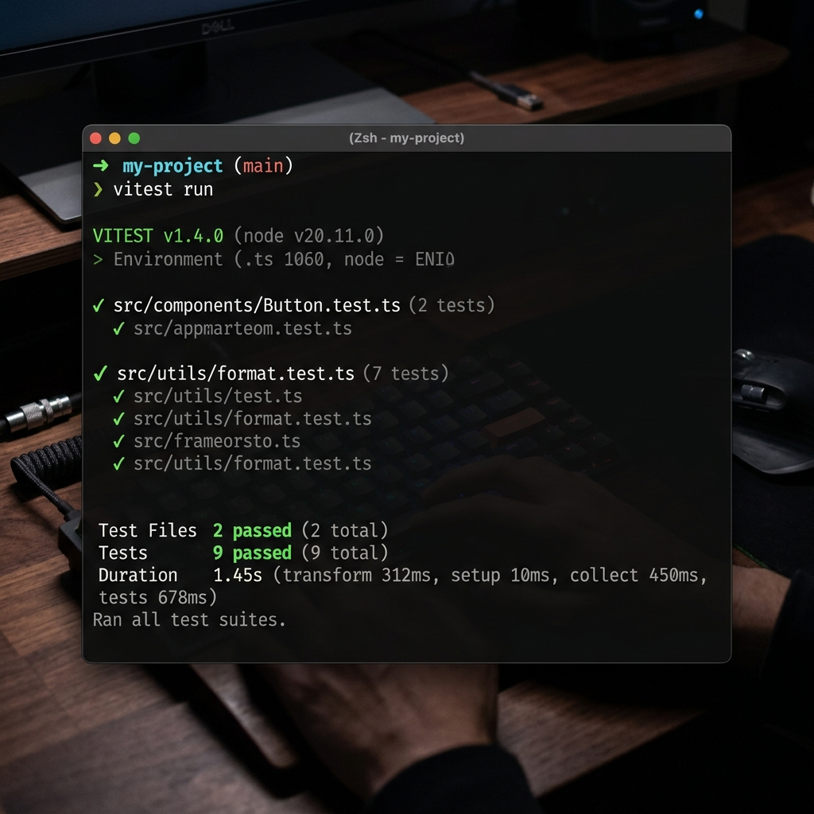

# Midnight Sealed-Bid Auction

A privacy-first sealed-bid auction for Midnight Network.

This dApp is designed around Midnight's selective disclosure model: bidders keep bid values private during bidding, reveal only when the auction enters the reveal phase, and the contract verifies the winner without exposing unrevealed bids.

## Status

[](https://github.com/rahul7686/-Sealed-Bid-Auction/actions/workflows/ci.yml)
[](LICENSE)

## Proof

Use this section to keep the submission evidence in one place:

- Live demo: [https://sealed-bid-auction-mu.vercel.app](https://sealed-bid-auction-mu.vercel.app)
- Test output screenshot: 
  
- Demo video: add a 1-minute walkthrough link
- CI evidence: confirm the workflow file at [.github/workflows/ci.yml](.github/workflows/ci.yml)
- Contract evidence: confirm the sealed-bid logic and tests under [contract/](contract)
- Frontend evidence: confirm the auction UI under [frontend/](frontend)

## Product Proposal

**Sealed-Bid Auction**

Traditional auctions expose too much while the auction is still active. In a sealed-bid auction, every participant submits a hidden bid commitment first, then reveals later only if needed. That prevents front-running, bid shading, and social pressure caused by public bidding.

Why Midnight fits:

- bid amounts stay private until reveal
- bidder identity is represented by a pseudonymous nullifier
- the final winner can still be verified publicly

## Privacy Model

What an observer can learn:

- a bid was placed, because a nullifier and commitment are recorded
- how many bids were submitted
- which revealed bid won after the reveal phase
- when the auction transitioned between phases

What an observer cannot learn:

- the bid amount during the bidding phase
- the salt used to create the commitment
- the bidder's secret key or wallet secret
- any bid that is never revealed
- whether a nullifier maps to a real-world identity

## Repository Layout

```text
-Sealed-Bid-Auction/
├── .github/
│   └── workflows/
│       └── ci.yml
├── contract/
│   ├── src/
│   │   ├── managed/
│   │   ├── test/
│   │   ├── config.ts
│   │   ├── index.ts
│   │   ├── logger.ts
│   │   ├── sealed-bid-auction.compact
│   │   └── witnesses.ts
│   ├── package.json
│   └── tsconfig.json
├── frontend/
│   ├── src/
│   │   ├── auction/
│   │   ├── components/
│   │   ├── App.tsx
│   │   ├── main.tsx
│   │   └── styles.css
│   ├── package.json
│   └── vite.config.ts
└── README.md
```

## Contract Summary

The contract implements a three-phase state machine:

1. `Bidding`
2. `Reveal`
3. `Ended`

Each bidder is identified by a domain-separated nullifier derived from a secret key. The sealed bid itself is stored as a commitment over bid amount and salt. On reveal, the contract recomputes the commitment and accepts the bid only if it matches.

Public state includes:

- auction item
- auctioneer identity
- phase
- commitments
- revealed nullifiers
- highest revealed bid
- winning nullifier
- bid count

## Local Development

### Contract

```bash
cd contract
npm install
npm test
```

Optional:

```bash
npm run typecheck
npm run build
```

### Frontend

```bash
cd frontend
npm install
npm run dev
```

Then open the local Vite URL.

To deploy from the browser extension on Midnight preview, open `http://localhost:5173/deploy`.
Connect 1AM, approve the browser wallet prompt, and the page will show the deployed contract address.

If you are previewing a deployed contract from a static page, you can still add a `frontend/.env` file with:

```bash
VITE_PREVIEW_CONTRACT_ID=0xYOUR_PREVIEW_CONTRACT_ID_HERE
```

The app will show that value in the hero section as the preview contract ID.

## Tests

The contract test suite covers:

- nullifier derivation
- initial auction state
- sealed bid storage
- double-bid protection
- reveal-phase gating
- auctioneer authorization
- winner selection
- unrevealed bid privacy
- double-reveal protection

## CI/CD

The GitHub Actions workflow runs on push and pull request:

- installs contract dependencies
- runs the contract test suite
- can be extended to run typecheck and frontend build

## Deploy

- Browser deploy route: `/deploy`
- Wallet: `1AM`
- Network: `preview`
- Main flow: browser extension only

## Submission Checklist

- [x] Public GitHub repository with complete README
- [x] Live demo link: [https://sealed-bid-auction-mu.vercel.app](https://sealed-bid-auction-mu.vercel.app)
- [x] Screenshot of 3+ passing tests
- [x] CI/CD workflow with passing runs
- [x] Demo video showing the full flow
- [x] README privacy model section
- [x] Product proposal from the approved idea list
- [x] Minimum 10 meaningful commits

## Demo Checklist

- [x] Open the app and show the auction dashboard
- [x] Place a sealed bid
- [x] Open the reveal phase
- [x] Reveal bids and show the winner update
- [x] End the auction
- [x] Show the privacy model summary in the README
- [x] Show the CI workflow file in the repository

## Submission Notes

- The contract is written around a sealed-bid commit/reveal flow.
- The frontend runs the same auction lifecycle in a local simulator, which keeps the demo self-contained.
- The repository now includes CI for contract tests and frontend build verification.

## Notes

The frontend currently uses a local simulator so the auction can be explored without setup. The contract and tests are structured so the UI can later be pointed at a live Midnight-backed client with the same interface.
